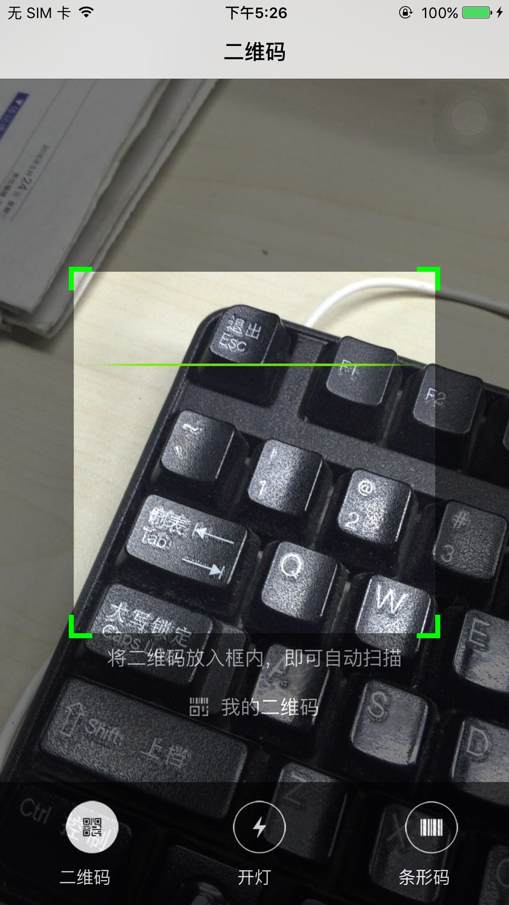
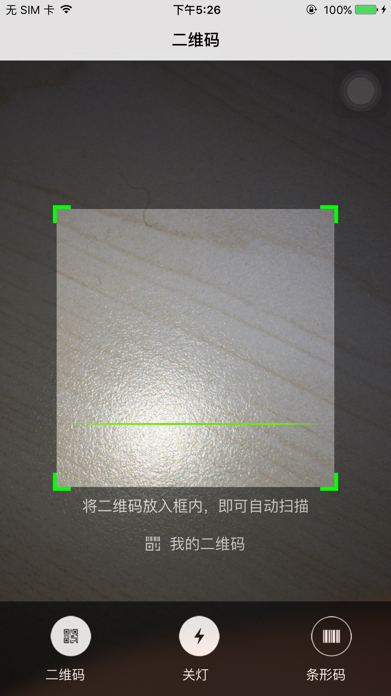

# QRCodeReaderView-Swift

<html>
<body>
<h2>什么是QRCodeReaderView-Swift</h2>

基于swift语言实现二维码条形码扫描，以及二维码的生成

<h2>效果图展示</h2>

<h3>二维码扫描关灯效果</h3>

<h3>开灯效果</h3>

<h3>条形码扫描</h3>

<h3>二维码生成</h3>

<h2>使用方法</h2>

demo里面有详细标注，这里不再做展示

</body>

</html>